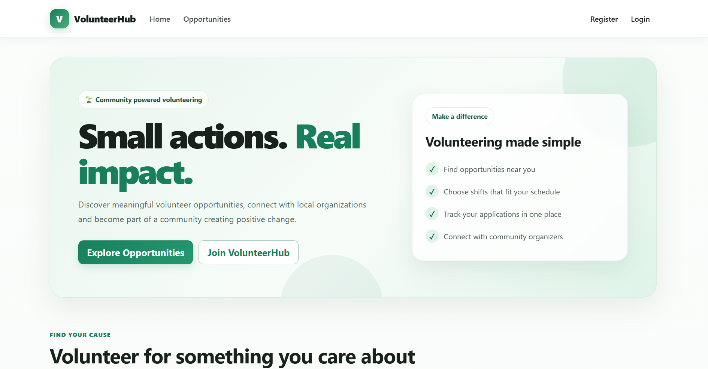
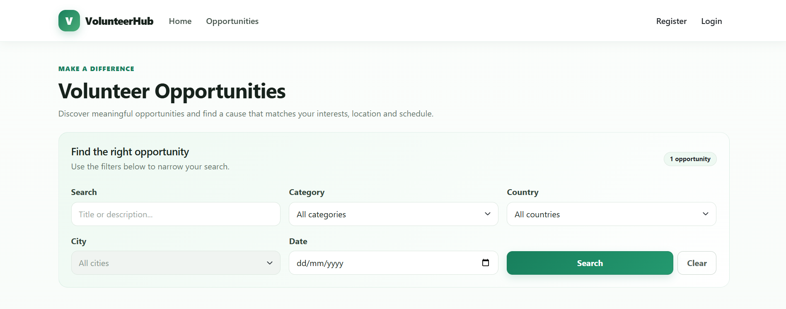
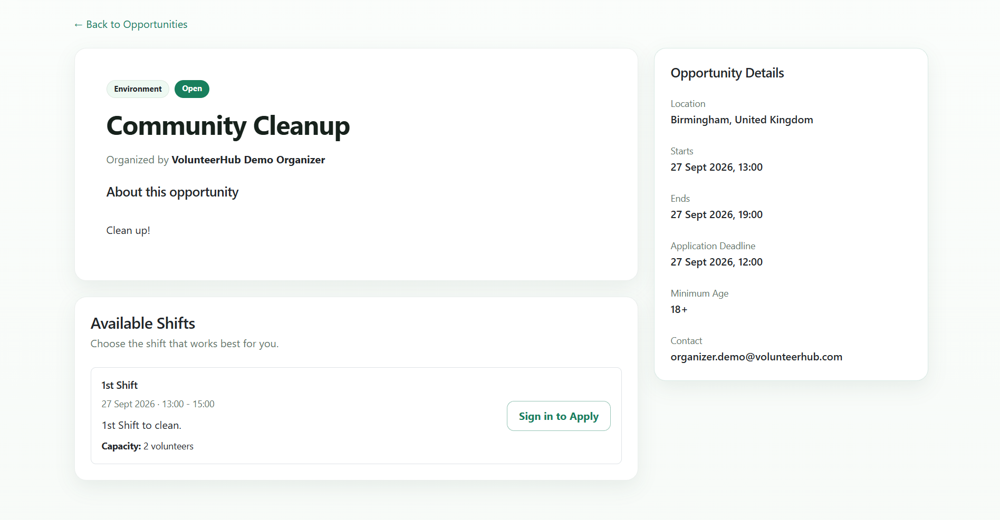
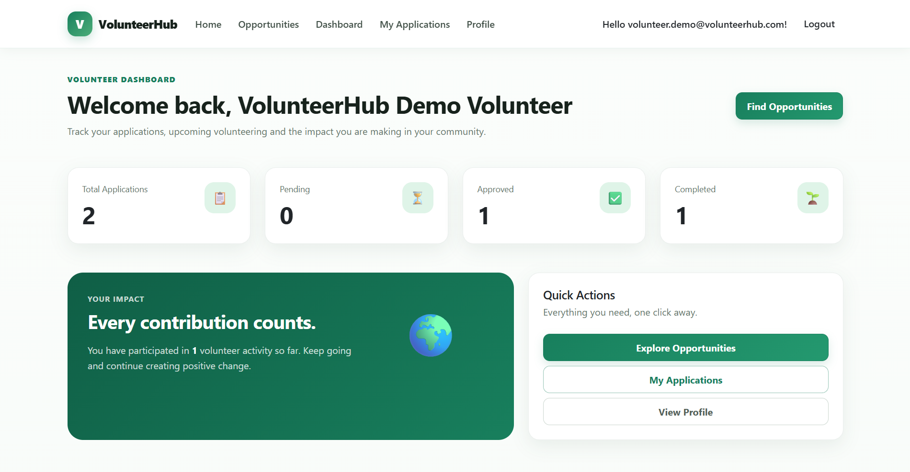
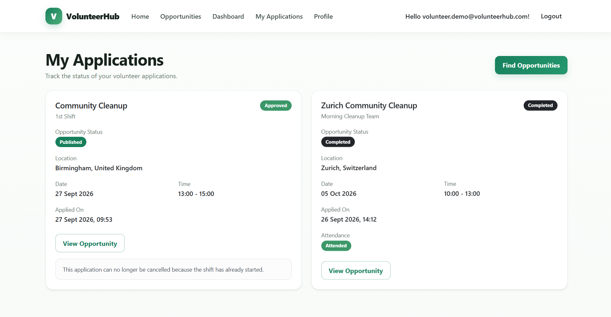
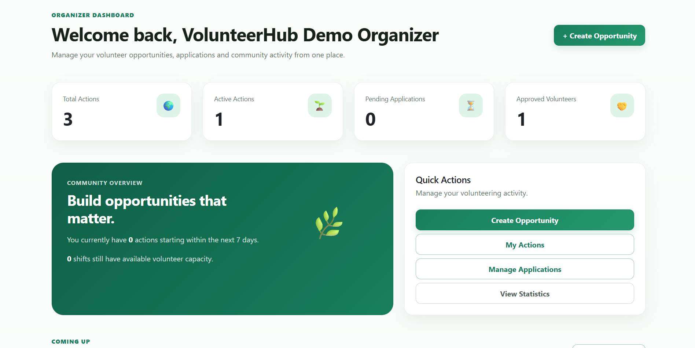
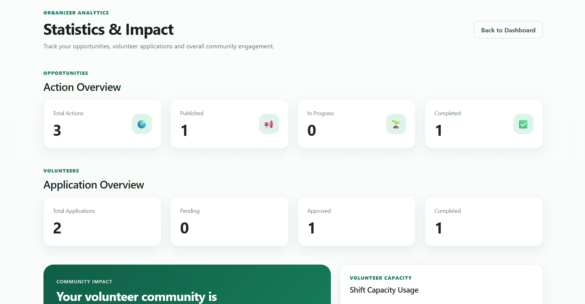

# VolunteerHub

VolunteerHub is a full-stack volunteer management web application built with ASP.NET Core MVC.

It connects volunteers with community opportunities while providing organizers with tools to create activities, manage shifts, review applications, track attendance and monitor participation.

The project was developed as a portfolio application with a focus on role-based authorization, business rules, security, maintainability and real-world workflow management.

---

## Live Demo

Deployment is currently being prepared.

**Live Demo:** Coming soon

Demo accounts are available for both Volunteer and Organizer roles.

---

## Demo Accounts

### Volunteer

```text
Email: volunteer.demo@volunteerhub.com
Password: Volunteer2026!
```

### Organizer

```text
Email: organizer.demo@volunteerhub.com
Password: Organizer2026!
```

The administrator account is intentionally not publicly shared.

---

# Screenshots

## Home Page



---

## Volunteer Opportunities

Search and filter volunteering opportunities by category, country, city and date.



---

## Opportunity Details

View opportunity information, location, schedule and available volunteer shifts.



---

## Volunteer Dashboard

Volunteers can monitor applications, approvals, completed activities and their overall participation.



---

## My Applications

Volunteers can track application status, attendance and participation history.



---

## Organizer Dashboard

Organizers receive an overview of their opportunities, volunteers, applications and available capacity.



---

## Organizer Statistics

The statistics dashboard provides insight into opportunities, applications, volunteers and community impact.



---

# Main Features

VolunteerHub supports three application roles:

- Volunteer
- Organizer
- Admin

Each role has its own authorization rules, dashboard and functionality.

---

## Volunteer Features

Volunteers can:

- Create an account and sign in
- Manage their profile
- Select their country and city
- Browse available volunteer opportunities
- Search opportunities
- Filter by category
- Filter by country and city
- Filter by date
- View opportunity details
- View available shifts
- Apply for volunteer shifts
- View application status
- Cancel eligible applications
- Join a waitlist when a shift is full
- Track upcoming participation
- View completed participation
- View attendance history
- Use a dedicated volunteer dashboard

---

## Organizer Features

Organizers can:

- Create volunteer opportunities
- Edit their own opportunities
- Manage opportunity lifecycle
- Create and manage shifts
- Define shift capacity
- Publish opportunities
- Start opportunities
- Complete opportunities
- Cancel opportunities
- Review volunteer applications
- Approve applications
- Reject applications
- Manage waitlisted volunteers
- Record volunteer attendance
- View recent applications
- Monitor available shift capacity
- View organizer statistics
- Use a dedicated organizer dashboard

---

## Admin Features

Administrators can:

- View system statistics
- View registered users
- View user roles
- Manage users
- View volunteer opportunities
- Access administrative dashboards
- Delete volunteer opportunities

Administrator credentials are not included in the public repository.

---

# Opportunity Lifecycle

Volunteer opportunities follow a controlled status workflow:

```text
Draft
  ↓
Published
  ↓
InProgress
  ↓
Completed
```

Published and in-progress opportunities may also be cancelled.

Supported opportunity statuses:

- Draft
- Published
- InProgress
- Completed
- Cancelled

Invalid status transitions are prevented by server-side business rules.

---

# Participation Request Lifecycle

Volunteer applications support the following statuses:

- Pending
- Approved
- Rejected
- Waitlist
- Cancelled
- Completed

The application also records whether a volunteer attended an approved shift.

---

# Business Rules

VolunteerHub contains server-side validation for important workflow rules.

Examples include:

- An opportunity cannot be published without at least one shift
- Volunteers cannot apply after the application deadline
- Volunteers cannot create duplicate active applications for the same shift
- Volunteers cannot create conflicting applications for overlapping shifts
- Shift capacity cannot be exceeded
- Full shifts automatically place new applicants on the waitlist
- Waitlisted applications cannot be approved while capacity is full
- When an approved volunteer cancels, the oldest waitlisted application can return to Pending
- Shift capacity cannot be reduced below the number of approved volunteers
- Shift start/end times cannot be changed after applications exist
- Published opportunity schedules are protected after applications exist
- Volunteers cannot cancel an application after the shift starts
- Attendance cannot be recorded before the shift starts
- Only approved volunteers can be marked as attended
- Organizers can only manage their own opportunities
- Organizers cannot modify opportunities owned by other organizers
- Shifts with application history cannot be deleted
- Invalid opportunity status transitions are blocked

These rules are enforced server-side rather than relying only on the user interface.

---

# Location System

VolunteerHub uses structured location data instead of free-text locations.

Users select:

```text
Country
   ↓
City
```

City options are dynamically filtered based on the selected country.

Each city belongs to a country through relational database entities.

---

# Time Zone Support

VolunteerHub contains explicit time-zone handling for volunteer opportunities.

Each supported country contains a configured time-zone identifier.

Opportunity schedules and shift schedules are treated as local times for the country where the opportunity takes place.

Examples:

```text
Switzerland       → Europe/Zurich
Greece            → Europe/Athens
Germany           → Europe/Berlin
United Kingdom    → Europe/London
```

Time-sensitive business rules use the opportunity's local time, including:

- Application deadlines
- Opportunity start validation
- Shift cancellation rules
- Attendance availability
- Upcoming dashboard information
- Starting-soon calculations

Audit timestamps such as registration dates and application creation dates are stored using UTC.

This avoids depending on the physical location or time zone of the web server.

---

# Security

VolunteerHub uses ASP.NET Core Identity for authentication and authorization.

Security features include:

- ASP.NET Core Identity
- Role-based authorization
- Volunteer authorization
- Organizer authorization
- Admin authorization
- Ownership validation
- Anti-forgery validation on POST actions
- Server-side business validation
- Secure password hashing through ASP.NET Core Identity
- Sensitive administrator credentials stored outside source code
- Development secrets stored using .NET User Secrets
- No production credentials stored in the repository

Administrator and demo seed credentials are read from configuration rather than being hard-coded in source code.

---

# Technologies

## Backend

- C#
- .NET 10
- ASP.NET Core MVC
- ASP.NET Core Identity
- Entity Framework Core

## Database

- SQL Server
- SQL Server LocalDB
- Entity Framework Core Migrations

## Frontend

- Razor Views
- HTML5
- CSS3
- Bootstrap
- JavaScript

## Development Tools

- Visual Studio
- SQL Server LocalDB
- Git
- GitHub

---

# Architecture

The application follows the ASP.NET Core MVC pattern.

```text
VolunteerHub
│
├── Constants
├── Controllers
├── Data
├── Models
├── Services
├── ViewModels
├── Views
├── Areas
│   └── Identity
├── docs
│   └── screenshots
├── wwwroot
├── Program.cs
└── appsettings.json
```

## Controllers

Handle HTTP requests, authorization and application workflows.

## Models

Represent database entities such as:

- ApplicationUser
- VolunteerAction
- Shift
- ParticipationRequest
- Country
- City

## ViewModels

Provide data specifically designed for application views and dashboards.

## Services

Contain reusable application services such as time-zone handling.

## Data

Contains:

- ApplicationDbContext
- Entity Framework migrations
- Database initialization
- Identity role initialization
- Configurable account seeding

---

# Database Relationships

The main application relationships include:

```text
Country
   ↓
Cities
   ↓
Volunteer Actions
   ↓
Shifts
   ↓
Participation Requests
```

Users can also be associated with a city for profile information.

Organizers own volunteer actions, while volunteers submit participation requests for individual shifts.

---

# Database Setup

The project uses Entity Framework Core migrations.

Using the Visual Studio Package Manager Console:

```powershell
Update-Database
```

This creates or updates the local database using the included migrations.

---

# Local Development

## Requirements

Install:

- Visual Studio 2022 or newer
- .NET 10 SDK
- SQL Server LocalDB
- Git

## Clone the Repository

```bash
git clone https://github.com/thrasosCH/VolunteerHub.git
```

Open the solution in Visual Studio.

## Database

The default development connection string uses SQL Server LocalDB:

```text
Server=(localdb)\mssqllocaldb;
Database=VolunteerHub;
Trusted_Connection=True;
MultipleActiveResultSets=true
```

Apply the migrations:

```powershell
Update-Database
```

---

# Development Secrets

Sensitive account credentials should not be added to `appsettings.json` or committed to Git.

For local development:

```text
Right-click project
→ Manage User Secrets
```

Example configuration:

```json
{
  "SeedAdmin": {
    "Email": "your-admin-email",
    "Password": "your-admin-password"
  }
}
```

Demo accounts can also be configured through User Secrets.

---

# Database Initialization

At application startup, VolunteerHub can automatically:

- Create required Identity roles
- Seed a configured administrator account
- Seed configured demo accounts
- Ensure seeded accounts have the correct roles

Account credentials are read from configuration rather than being stored directly in source code.

---

# Testing

The core application workflow has been manually tested end to end.

Main tested lifecycle:

```text
Organizer
   ↓
Create Opportunity
   ↓
Create Shift
   ↓
Publish
   ↓
Volunteer Applies
   ↓
Organizer Approves
   ↓
Start Opportunity
   ↓
Record Attendance
   ↓
Complete Opportunity
```

Additional validation testing includes:

- Publishing without shifts
- Duplicate applications
- Overlapping applications
- Shift capacity limits
- Waitlist behavior
- Waitlist promotion
- Capacity reduction protection
- Shift schedule protection
- Opportunity schedule protection
- Application deadline validation
- Cancellation after shift start
- Attendance before shift start
- Unauthorized organizer access
- Shift deletion protection
- Invalid status transitions

---

# Database Migration Verification

The complete migration history has been tested against a clean database.

This verifies that the application database can be created from scratch using only the migrations included in the repository.

---

# Deployment

The application is being prepared for deployment using:

- GitHub
- Azure App Service
- Azure SQL Database

Production secrets and database credentials will be stored using Azure configuration/environment settings and will not be committed to GitHub.

---

# Future Improvements

Possible future enhancements include:

- Email notifications
- Password reset email integration
- Opportunity images
- Maps and geolocation
- Volunteer certificates
- Organizer notifications
- Advanced reporting
- Pagination
- Automated unit and integration tests
- CI/CD with GitHub Actions
- Additional countries and cities
- Expanded time-zone support

---

# Project Purpose

VolunteerHub was developed as a portfolio project to demonstrate practical knowledge of:

- C#
- ASP.NET Core MVC
- Entity Framework Core
- SQL Server
- ASP.NET Core Identity
- Role-based authorization
- Relational database design
- Business-rule implementation
- Secure configuration
- Time-zone aware applications
- Responsive web interfaces
- Git and GitHub workflow

The goal is to demonstrate the design and implementation of a complete multi-role web application based on realistic business requirements.

---

# Author

**Thrasyvoulos Charalampidis**

Software Development Portfolio Project